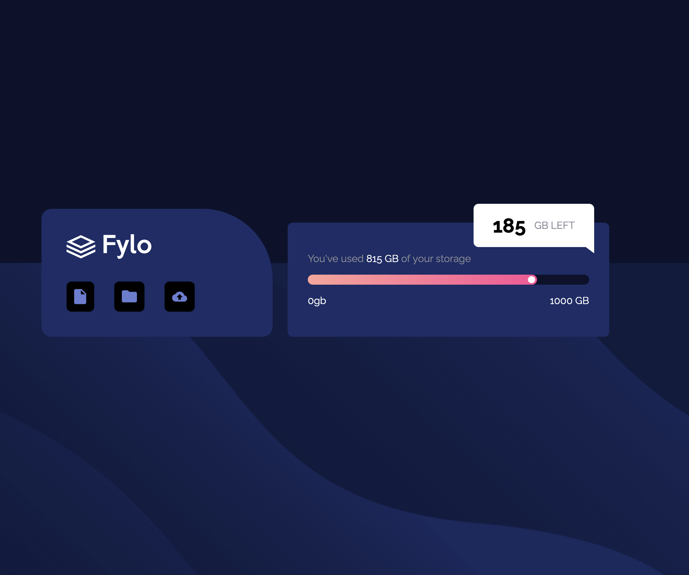

# Fylo_data_storage_component
# Frontend Mentor - Fylo data storage component solution

This is a solution to the [Fylo data storage component challenge on Frontend Mentor](https://frontendmentor.io). Frontend Mentor challenges help you improve your coding skills by building realistic projects. 

## Table of contents

- [Overview](#overview)
  - [The challenge](#the-challenge)
  - [Screenshot](#screenshot)
  - [Links](#links)
- [My process](#my-process)
  - [Built with](#built-with)
  - [What I learned](#what-i-learned)
  - [Continued development](#continued-development)
- [Author](#author)

## Overview

### The challenge

Users should be able to:

- View the optimal layout for the site depending on their device's screen size
- See hover states for all interactive elements on the page

### Screenshot

 *(Note: Replace this with the actual path to your screenshot if it is different)*

### Links

- Solution URL: [GitHub Repo](https://github.com/Agalya141/Fylo_data_storage_component)
- Live Site URL: [Live Demo](https://agalya141.github.io/Fylo_data_storage_component/)

## My process

### Built with

- Semantic HTML5 markup
- CSS Custom Properties (Variables)
- Flexbox layout model
- Mobile-first/Responsive workflow
- Google Fonts integration

### What I learned

During this project, I strengthened my understanding of CSS layout mechanics and responsive design. Specifically, I practiced:

1. **Atomic Commits:** Tracking incremental progress cleanly in Git (including asset management and spacing adjustments).
2. **Absolute Positioning:** Creating floating overlay components like the "GB Left" indicator box and aligning them dynamically for different viewports using media queries.
3. **Custom Progress Bars:** Designing gradient-filled tracks using pure CSS gradients and pseudo-elements (`:after`).

```css
/* Example of the gradient bar fill I implemented */
.percentage-fill {
    background: linear-gradient(to right, var(--Gradient));
    border-radius: 4rem;
    width: 81.5%;
    height: 100%;
    position: relative;
}
```

### Continued development

In future projects, I want to focus on:
- Exploring Advanced CSS Grid systems alongside Flexbox.
- Mastering complex responsive layout transformations without using restrictive container heights.

## Author

- GitHub - [@Agalya141](https://github.com/Agalya141)
- Frontend Mentor - [@Agalya141](https://www.frontendmentor.io/profile/Agalya141)
- LinkedIn - [Agalya M](https://www.linkedin.com/in/agalya6)